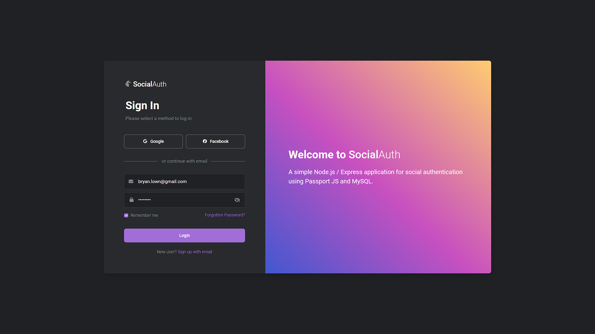

# Social Authentication with Passport and MySQL

`social.auth` is simple Node.js / Express application for social authentication. Authentication is Passport JS based using Google OAuth2, Facebook, and local strategies, and uses a MySQL database to store user data upon signing up / logging in. It can be used as a template for any app that requires social authentication, and includes: profile management, themes, user admin, repsonsive web design, and cross-browser compatability.  

